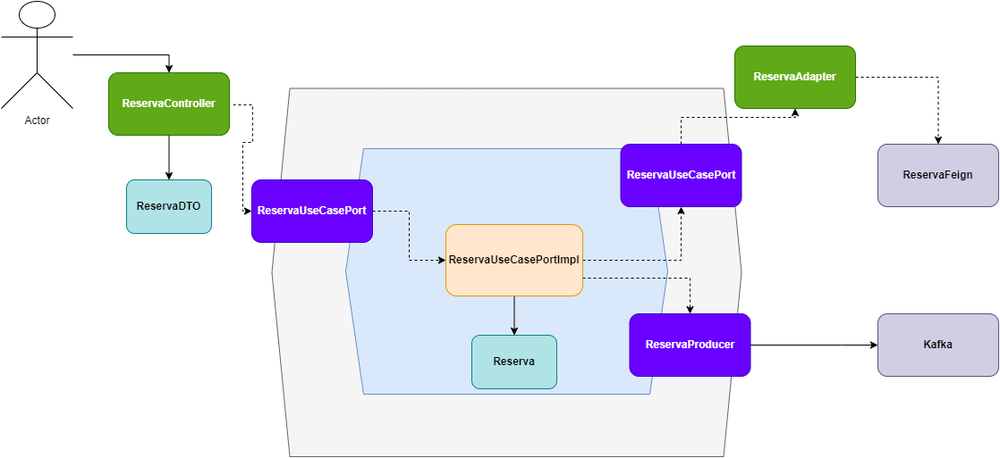

<p align="center">
  
</p>
<p align="center">
    <h1 align="center">EVENTOS-SPRING</h1>
</p>
<p align="center">
    <em><code>► Exemplo de aplicação com 2 microsserviços utilizando arquitetura hexagonal, kafka, mongo, feign</code></em>
</p>
<p align="center">
	
	
	
	
<p>
<p align="center">
	<!-- default option, no dependency badges. -->
</p>

<br><!-- TABLE OF CONTENTS -->
<details>
  <summary>Table of Contents</summary><br>

- [ Overview](#-overview)
- [ Features](#-features)
- [ Repository Structure](#-repository-structure)
- [ Modules](#-modules)
- [ Getting Started](#-getting-started)
    - [ Installation](#-installation)
    - [ Usage](#-usage)
    - [ Tests](#-tests)
- [ Contributing](#-contributing)
- [ License](#-license)
- [ Acknowledgments](#-acknowledgments)
</details>
<hr>

##  Overview

<code>► Microsserviços em Java 17 e Spring, utilizando arquitetura hexagonal, kafka, mongo, feign</code>



---

##  Features

<code>
► Java 17
► Spring
► Docker
► Kafka
► Mongo
► Feign
</code>

---

##  Repository Structure

```sh
└── eventos-spring/
    ├── Docker
    │   └── docker-compose.yml
    ├── README.md
    ├── ms-eventos-restspringkafka
    │   ├── .gitignore
    │   ├── mvnw
    │   ├── mvnw.cmd
    │   ├── pom.xml
    │   └── src
    └── ms-eventos-springkafkamongo
        ├── .gitignore
        ├── mvnw
        ├── mvnw.cmd
        ├── pom.xml
        └── src
```

---

##  Modules

<details closed><summary>Docker</summary>

| File                                                                                                          | Summary                         |
| ---                                                                                                           | ---                             |
| [docker-compose.yml](https://github.com/hamiltonvalerio/eventos-spring/blob/master/Docker/docker-compose.yml) | <code>► INSERT-TEXT-HERE</code> |

</details>

<details closed><summary>ms-eventos-springkafkamongo</summary>

| File                                                                                                           | Summary                         |
| ---                                                                                                            | ---                             |
| [mvnw](https://github.com/hamiltonvalerio/eventos-spring/blob/master/ms-eventos-springkafkamongo/mvnw)         | <code>► INSERT-TEXT-HERE</code> |
| [mvnw.cmd](https://github.com/hamiltonvalerio/eventos-spring/blob/master/ms-eventos-springkafkamongo/mvnw.cmd) | <code>► INSERT-TEXT-HERE</code> |

</details>

<details closed><summary>ms-eventos-springkafkamongo.src.test.java.br.eti.valerio.mseventosspringkafkamongo</summary>

| File                                                                                                                                                                                                                                              | Summary                         |
| ---                                                                                                                                                                                                                                               | ---                             |
| [MsEventosSpringkafkamongoApplicationTests.java](https://github.com/hamiltonvalerio/eventos-spring/blob/master/ms-eventos-springkafkamongo/src/test/java/br/eti/valerio/mseventosspringkafkamongo/MsEventosSpringkafkamongoApplicationTests.java) | <code>► INSERT-TEXT-HERE</code> |

</details>

<details closed><summary>ms-eventos-springkafkamongo.src.main.java.br.eti.valerio.mseventosspringkafkamongo</summary>

| File                                                                                                                                                                                                                                    | Summary                         |
| ---                                                                                                                                                                                                                                     | ---                             |
| [MsEventosSpringkafkamongoApplication.java](https://github.com/hamiltonvalerio/eventos-spring/blob/master/ms-eventos-springkafkamongo/src/main/java/br/eti/valerio/mseventosspringkafkamongo/MsEventosSpringkafkamongoApplication.java) | <code>► INSERT-TEXT-HERE</code> |

</details>

<details closed><summary>ms-eventos-springkafkamongo.src.main.java.br.eti.valerio.mseventosspringkafkamongo.infra.kafka.config</summary>

| File                                                                                                                                                                                                                   | Summary                         |
| ---                                                                                                                                                                                                                    | ---                             |
| [KafkaTopicosConfig.java](https://github.com/hamiltonvalerio/eventos-spring/blob/master/ms-eventos-springkafkamongo/src/main/java/br/eti/valerio/mseventosspringkafkamongo/infra/kafka/config/KafkaTopicosConfig.java) | <code>► INSERT-TEXT-HERE</code> |

</details>

<details closed><summary>ms-eventos-springkafkamongo.src.main.java.br.eti.valerio.mseventosspringkafkamongo.infra.kafka.reserva</summary>

| File                                                                                                                                                                                                                      | Summary                         |
| ---                                                                                                                                                                                                                       | ---                             |
| [ReservaConsumerImpl.java](https://github.com/hamiltonvalerio/eventos-spring/blob/master/ms-eventos-springkafkamongo/src/main/java/br/eti/valerio/mseventosspringkafkamongo/infra/kafka/reserva/ReservaConsumerImpl.java) | <code>► INSERT-TEXT-HERE</code> |

</details>

<details closed><summary>ms-eventos-springkafkamongo.src.main.java.br.eti.valerio.mseventosspringkafkamongo.adapter.input.dto</summary>

| File                                                                                                                                                                                                  | Summary                         |
| ---                                                                                                                                                                                                   | ---                             |
| [ReservaDTO.java](https://github.com/hamiltonvalerio/eventos-spring/blob/master/ms-eventos-springkafkamongo/src/main/java/br/eti/valerio/mseventosspringkafkamongo/adapter/input/dto/ReservaDTO.java) | <code>► INSERT-TEXT-HERE</code> |

</details>

<details closed><summary>ms-eventos-springkafkamongo.src.main.java.br.eti.valerio.mseventosspringkafkamongo.adapter.input.mapper</summary>

| File                                                                                                                                                                                                           | Summary                         |
| ---                                                                                                                                                                                                            | ---                             |
| [MapperReserva.java](https://github.com/hamiltonvalerio/eventos-spring/blob/master/ms-eventos-springkafkamongo/src/main/java/br/eti/valerio/mseventosspringkafkamongo/adapter/input/mapper/MapperReserva.java) | <code>► INSERT-TEXT-HERE</code> |

</details>

<details closed><summary>ms-eventos-springkafkamongo.src.main.java.br.eti.valerio.mseventosspringkafkamongo.adapter.input.controller</summary>

| File                                                                                                                                                                                                                       | Summary                         |
| ---                                                                                                                                                                                                                        | ---                             |
| [ReservaController.java](https://github.com/hamiltonvalerio/eventos-spring/blob/master/ms-eventos-springkafkamongo/src/main/java/br/eti/valerio/mseventosspringkafkamongo/adapter/input/controller/ReservaController.java) | <code>► INSERT-TEXT-HERE</code> |

</details>

<details closed><summary>ms-eventos-springkafkamongo.src.main.java.br.eti.valerio.mseventosspringkafkamongo.adapter.output.reserva</summary>

| File                                                                                                                                                                                                               | Summary                         |
| ---                                                                                                                                                                                                                | ---                             |
| [ReservaAdapter.java](https://github.com/hamiltonvalerio/eventos-spring/blob/master/ms-eventos-springkafkamongo/src/main/java/br/eti/valerio/mseventosspringkafkamongo/adapter/output/reserva/ReservaAdapter.java) | <code>► INSERT-TEXT-HERE</code> |

</details>

<details closed><summary>ms-eventos-springkafkamongo.src.main.java.br.eti.valerio.mseventosspringkafkamongo.adapter.output.mongo</summary>

| File                                                                                                                                                                                                                   | Summary                         |
| ---                                                                                                                                                                                                                    | ---                             |
| [ReservaRepository.java](https://github.com/hamiltonvalerio/eventos-spring/blob/master/ms-eventos-springkafkamongo/src/main/java/br/eti/valerio/mseventosspringkafkamongo/adapter/output/mongo/ReservaRepository.java) | <code>► INSERT-TEXT-HERE</code> |

</details>

<details closed><summary>ms-eventos-springkafkamongo.src.main.java.br.eti.valerio.mseventosspringkafkamongo.adapter.output.kafka.consumer</summary>

| File                                                                                                                                                                                                                        | Summary                         |
| ---                                                                                                                                                                                                                         | ---                             |
| [ReservaConsumer.java](https://github.com/hamiltonvalerio/eventos-spring/blob/master/ms-eventos-springkafkamongo/src/main/java/br/eti/valerio/mseventosspringkafkamongo/adapter/output/kafka/consumer/ReservaConsumer.java) | <code>► INSERT-TEXT-HERE</code> |

</details>

<details closed><summary>ms-eventos-springkafkamongo.src.main.java.br.eti.valerio.mseventosspringkafkamongo.coredomain.entity</summary>

| File                                                                                                                                                                                            | Summary                         |
| ---                                                                                                                                                                                             | ---                             |
| [Reserva.java](https://github.com/hamiltonvalerio/eventos-spring/blob/master/ms-eventos-springkafkamongo/src/main/java/br/eti/valerio/mseventosspringkafkamongo/coredomain/entity/Reserva.java) | <code>► INSERT-TEXT-HERE</code> |

</details>

<details closed><summary>ms-eventos-springkafkamongo.src.main.java.br.eti.valerio.mseventosspringkafkamongo.coredomain.usecase</summary>

| File                                                                                                                                                                                                                           | Summary                         |
| ---                                                                                                                                                                                                                            | ---                             |
| [ReservaUseCasePortImpl.java](https://github.com/hamiltonvalerio/eventos-spring/blob/master/ms-eventos-springkafkamongo/src/main/java/br/eti/valerio/mseventosspringkafkamongo/coredomain/usecase/ReservaUseCasePortImpl.java) | <code>► INSERT-TEXT-HERE</code> |

</details>

<details closed><summary>ms-eventos-springkafkamongo.src.main.java.br.eti.valerio.mseventosspringkafkamongo.application.ports.in</summary>

| File                                                                                                                                                                                                                     | Summary                         |
| ---                                                                                                                                                                                                                      | ---                             |
| [ReservaUseCasePort.java](https://github.com/hamiltonvalerio/eventos-spring/blob/master/ms-eventos-springkafkamongo/src/main/java/br/eti/valerio/mseventosspringkafkamongo/application/ports/in/ReservaUseCasePort.java) | <code>► INSERT-TEXT-HERE</code> |

</details>

<details closed><summary>ms-eventos-springkafkamongo.src.main.java.br.eti.valerio.mseventosspringkafkamongo.application.ports.out</summary>

| File                                                                                                                                                                                                        | Summary                         |
| ---                                                                                                                                                                                                         | ---                             |
| [ReservaPort.java](https://github.com/hamiltonvalerio/eventos-spring/blob/master/ms-eventos-springkafkamongo/src/main/java/br/eti/valerio/mseventosspringkafkamongo/application/ports/out/ReservaPort.java) | <code>► INSERT-TEXT-HERE</code> |

</details>

<details closed><summary>ms-eventos-restspringkafka</summary>

| File                                                                                                          | Summary                         |
| ---                                                                                                           | ---                             |
| [mvnw](https://github.com/hamiltonvalerio/eventos-spring/blob/master/ms-eventos-restspringkafka/mvnw)         | <code>► INSERT-TEXT-HERE</code> |
| [mvnw.cmd](https://github.com/hamiltonvalerio/eventos-spring/blob/master/ms-eventos-restspringkafka/mvnw.cmd) | <code>► INSERT-TEXT-HERE</code> |

</details>

<details closed><summary>ms-eventos-restspringkafka.src.test.java.br.eti.valerio.mseventosrestspringkafka</summary>

| File                                                                                                                                                                                                                                          | Summary                         |
| ---                                                                                                                                                                                                                                           | ---                             |
| [MsEventosRestspringkafkaApplicationTests.java](https://github.com/hamiltonvalerio/eventos-spring/blob/master/ms-eventos-restspringkafka/src/test/java/br/eti/valerio/mseventosrestspringkafka/MsEventosRestspringkafkaApplicationTests.java) | <code>► INSERT-TEXT-HERE</code> |

</details>

<details closed><summary>ms-eventos-restspringkafka.src.main.java.br.eti.valerio.mseventosrestspringkafka</summary>

| File                                                                                                                                                                                                                                | Summary                         |
| ---                                                                                                                                                                                                                                 | ---                             |
| [MsEventosRestspringkafkaApplication.java](https://github.com/hamiltonvalerio/eventos-spring/blob/master/ms-eventos-restspringkafka/src/main/java/br/eti/valerio/mseventosrestspringkafka/MsEventosRestspringkafkaApplication.java) | <code>► INSERT-TEXT-HERE</code> |

</details>

<details closed><summary>ms-eventos-restspringkafka.src.main.java.br.eti.valerio.mseventosrestspringkafka.infra.kafka.reserva</summary>

| File                                                                                                                                                                                                                    | Summary                         |
| ---                                                                                                                                                                                                                     | ---                             |
| [ReservaProducerImpl.java](https://github.com/hamiltonvalerio/eventos-spring/blob/master/ms-eventos-restspringkafka/src/main/java/br/eti/valerio/mseventosrestspringkafka/infra/kafka/reserva/ReservaProducerImpl.java) | <code>► INSERT-TEXT-HERE</code> |

</details>

<details closed><summary>ms-eventos-restspringkafka.src.main.java.br.eti.valerio.mseventosrestspringkafka.infra.feign.config</summary>

| File                                                                                                                                                                                                                   | Summary                         |
| ---                                                                                                                                                                                                                    | ---                             |
| [ClientConfiguration.java](https://github.com/hamiltonvalerio/eventos-spring/blob/master/ms-eventos-restspringkafka/src/main/java/br/eti/valerio/mseventosrestspringkafka/infra/feign/config/ClientConfiguration.java) | <code>► INSERT-TEXT-HERE</code> |

</details>

<details closed><summary>ms-eventos-restspringkafka.src.main.java.br.eti.valerio.mseventosrestspringkafka.adapter.input.dto</summary>

| File                                                                                                                                                                                                | Summary                         |
| ---                                                                                                                                                                                                 | ---                             |
| [ReservaDTO.java](https://github.com/hamiltonvalerio/eventos-spring/blob/master/ms-eventos-restspringkafka/src/main/java/br/eti/valerio/mseventosrestspringkafka/adapter/input/dto/ReservaDTO.java) | <code>► INSERT-TEXT-HERE</code> |

</details>

<details closed><summary>ms-eventos-restspringkafka.src.main.java.br.eti.valerio.mseventosrestspringkafka.adapter.input.mapper</summary>

| File                                                                                                                                                                                                         | Summary                         |
| ---                                                                                                                                                                                                          | ---                             |
| [MapperReserva.java](https://github.com/hamiltonvalerio/eventos-spring/blob/master/ms-eventos-restspringkafka/src/main/java/br/eti/valerio/mseventosrestspringkafka/adapter/input/mapper/MapperReserva.java) | <code>► INSERT-TEXT-HERE</code> |

</details>

<details closed><summary>ms-eventos-restspringkafka.src.main.java.br.eti.valerio.mseventosrestspringkafka.adapter.input.controller</summary>

| File                                                                                                                                                                                                                     | Summary                         |
| ---                                                                                                                                                                                                                      | ---                             |
| [ReservaController.java](https://github.com/hamiltonvalerio/eventos-spring/blob/master/ms-eventos-restspringkafka/src/main/java/br/eti/valerio/mseventosrestspringkafka/adapter/input/controller/ReservaController.java) | <code>► INSERT-TEXT-HERE</code> |

</details>

<details closed><summary>ms-eventos-restspringkafka.src.main.java.br.eti.valerio.mseventosrestspringkafka.adapter.output.reserva</summary>

| File                                                                                                                                                                                                             | Summary                         |
| ---                                                                                                                                                                                                              | ---                             |
| [ReservaAdapter.java](https://github.com/hamiltonvalerio/eventos-spring/blob/master/ms-eventos-restspringkafka/src/main/java/br/eti/valerio/mseventosrestspringkafka/adapter/output/reserva/ReservaAdapter.java) | <code>► INSERT-TEXT-HERE</code> |

</details>

<details closed><summary>ms-eventos-restspringkafka.src.main.java.br.eti.valerio.mseventosrestspringkafka.adapter.output.feign</summary>

| File                                                                                                                                                                                                       | Summary                         |
| ---                                                                                                                                                                                                        | ---                             |
| [ReservaFeign.java](https://github.com/hamiltonvalerio/eventos-spring/blob/master/ms-eventos-restspringkafka/src/main/java/br/eti/valerio/mseventosrestspringkafka/adapter/output/feign/ReservaFeign.java) | <code>► INSERT-TEXT-HERE</code> |

</details>

<details closed><summary>ms-eventos-restspringkafka.src.main.java.br.eti.valerio.mseventosrestspringkafka.coredomain.entity</summary>

| File                                                                                                                                                                                          | Summary                         |
| ---                                                                                                                                                                                           | ---                             |
| [Reserva.java](https://github.com/hamiltonvalerio/eventos-spring/blob/master/ms-eventos-restspringkafka/src/main/java/br/eti/valerio/mseventosrestspringkafka/coredomain/entity/Reserva.java) | <code>► INSERT-TEXT-HERE</code> |

</details>

<details closed><summary>ms-eventos-restspringkafka.src.main.java.br.eti.valerio.mseventosrestspringkafka.coredomain.usecase</summary>

| File                                                                                                                                                                                                                         | Summary                         |
| ---                                                                                                                                                                                                                          | ---                             |
| [ReservaUseCasePortImpl.java](https://github.com/hamiltonvalerio/eventos-spring/blob/master/ms-eventos-restspringkafka/src/main/java/br/eti/valerio/mseventosrestspringkafka/coredomain/usecase/ReservaUseCasePortImpl.java) | <code>► INSERT-TEXT-HERE</code> |

</details>

<details closed><summary>ms-eventos-restspringkafka.src.main.java.br.eti.valerio.mseventosrestspringkafka.application.ports.in</summary>

| File                                                                                                                                                                                                                   | Summary                         |
| ---                                                                                                                                                                                                                    | ---                             |
| [ReservaUseCasePort.java](https://github.com/hamiltonvalerio/eventos-spring/blob/master/ms-eventos-restspringkafka/src/main/java/br/eti/valerio/mseventosrestspringkafka/application/ports/in/ReservaUseCasePort.java) | <code>► INSERT-TEXT-HERE</code> |
| [ReservaProducer.java](https://github.com/hamiltonvalerio/eventos-spring/blob/master/ms-eventos-restspringkafka/src/main/java/br/eti/valerio/mseventosrestspringkafka/application/ports/in/ReservaProducer.java)       | <code>► INSERT-TEXT-HERE</code> |

</details>

<details closed><summary>ms-eventos-restspringkafka.src.main.java.br.eti.valerio.mseventosrestspringkafka.application.ports.out</summary>

| File                                                                                                                                                                                                      | Summary                         |
| ---                                                                                                                                                                                                       | ---                             |
| [ReservaPort.java](https://github.com/hamiltonvalerio/eventos-spring/blob/master/ms-eventos-restspringkafka/src/main/java/br/eti/valerio/mseventosrestspringkafka/application/ports/out/ReservaPort.java) | <code>► INSERT-TEXT-HERE</code> |

</details>

---

##  Getting Started

**System Requirements:**

* **Java**: `version x.y.z`

###  Installation

<h4>From <code>source</code></h4>

> 1. Clone the eventos-spring repository:
>
> ```console
> $ git clone https://github.com/hamiltonvalerio/eventos-spring
> ```
>
> 2. Change to the project directory:
> ```console
> $ cd eventos-spring
> ```
>
> 3. Install the dependencies:
> ```console
> $ mvn clean install
> ```

###  Usage

<h4>From <code>source</code></h4>

> Run eventos-spring using the command below:
> ```console
> $ java -jar target/myapp.jar
> ```

###  Tests

> Run the test suite using the command below:
> ```console
> $ mvn test
> ```

---

##  Contributing

Contributions are welcome! Here are several ways you can contribute:

- **[Report Issues](https://github.com/hamiltonvalerio/eventos-spring/issues)**: Submit bugs found or log feature requests for the `eventos-spring` project.
- **[Submit Pull Requests](https://github.com/hamiltonvalerio/eventos-spring/blob/main/CONTRIBUTING.md)**: Review open PRs, and submit your own PRs.
- **[Join the Discussions](https://github.com/hamiltonvalerio/eventos-spring/discussions)**: Share your insights, provide feedback, or ask questions.

<details closed>
<summary>Contributing Guidelines</summary>

1. **Fork the Repository**: Start by forking the project repository to your github account.
2. **Clone Locally**: Clone the forked repository to your local machine using a git client.
   ```sh
   git clone https://github.com/hamiltonvalerio/eventos-spring
   ```
3. **Create a New Branch**: Always work on a new branch, giving it a descriptive name.
   ```sh
   git checkout -b new-feature-x
   ```
4. **Make Your Changes**: Develop and test your changes locally.
5. **Commit Your Changes**: Commit with a clear message describing your updates.
   ```sh
   git commit -m 'Implemented new feature x.'
   ```
6. **Push to github**: Push the changes to your forked repository.
   ```sh
   git push origin new-feature-x
   ```
7. **Submit a Pull Request**: Create a PR against the original project repository. Clearly describe the changes and their motivations.
8. **Review**: Once your PR is reviewed and approved, it will be merged into the main branch. Congratulations on your contribution!
</details>

<details closed>
<summary>Contributor Graph</summary>
<br>
<p align="center">
   <a href="https://github.com{/hamiltonvalerio/eventos-spring/}graphs/contributors">
      
   </a>
</p>
</details>

---

##  License

This project is protected under the [GNU AGPLv3](https://choosealicense.com/licenses/agpl-3.0/#) License. For more details, refer to the [LICENSE](https://choosealicense.com/licenses/) file.

---

##  Acknowledgments

- List any resources, contributors, inspiration, etc. here.

[**Return**](#-overview)

---

